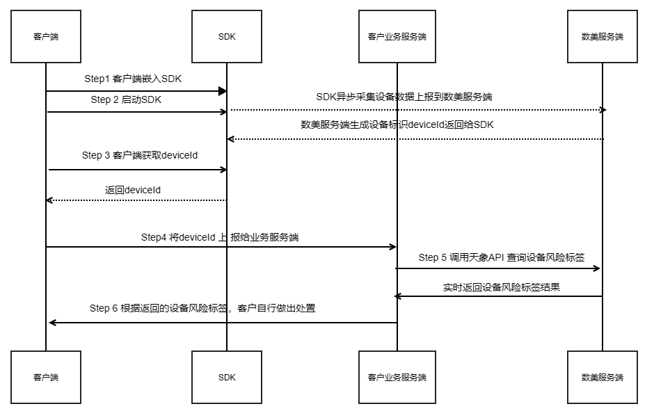

# 数美天象产品API接口说明文档
## 设备风险画像

- - - - -

***版权所有 翻版必究***

- - - - -

目录

- [数美天象产品API接口说明文档](#数美天象产品api接口说明文档)
  - [设备风险画像](#设备风险画像)
- [天象风险识别](#天象风险识别)
  - [调用时机](#调用时机)
  - [天象数据流图](#天象数据流图)
  - [具体接口](#具体接口)
    - [请求URL：](#请求url)
    - [请求方法：](#请求方法)
    - [字符编码：](#字符编码)
    - [建议超时时间：](#建议超时时间)
    - [请求参数：](#请求参数)
  - [返回结果](#返回结果)
  - [示例：](#示例)
    - [请求示例：](#请求示例)
    - [返回示例:](#返回示例)

# 天象风险识别

## 调用时机

在需要进行风险识别时调用本接口，例如：

1. 新用户注册后，进行风险画像查询，用于新人红包、注册礼物等的差异化投放；
2. 存量用户登录后，进行风险画像查询，用于日常活动运营的差异化投放；
3. 活动奖励下发前，进行风险画像查询，例如随机红包、抽奖等概率性活动；
4. 每日的例行查询，进行画像库或风控引擎的数据更新。

## 天象数据流图




## 具体接口

### 请求URL：
| 集群   | URL                                                        | 支持产品列表 |
|------|------------------------------------------------------------|--------|
| 北京   | `http://api-tianxiang-bj.fengkongcloud.com/tianxiang/v4`   | 天象风险识别 |
| 新加坡  | `http://api-tianxiang-xjp.fengkongcloud.com/tianxiang/v4`  | 天象风险识别 |
| 法兰克福 | `http://api-tianxiang-eur.fengkongcloud.com/tianxiang/v4`  | 天象风险识别 |
| 弗吉尼亚 | `http://api-tianxiang-fjny.fengkongcloud.com/tianxiang/v4` | 天象风险识别 |

### 请求方法：

`POST`

### 字符编码：

`UTF-8`

### 建议超时时间：

1s

### 请求参数：

放在HTTP Body中，采用Json格式，具体参数如下：

| **请求参数名** | **类型**      | **参数说明**                                              | **传入说明** | **规范**                           |
|-----------|-------------|-------------------------------------------------------|----------|----------------------------------|
| accessKey | string      | 接口认证密钥<br/>用于权限认证，开通账号服务时由数美提供或使用开通邮箱登录数美后台右上角相关文档处查看 | 必传参数     | 数美分配                             |
| data      | json_object | 请求的数据内容                                               | 必传参数     | 请求的数据内容，最长10MB，[详见data参数](#data) |

其中，data的内容如下：

| **请求参数名**   | **类型** | **参数说明**                            | **是否必传** | **规范**                                                                                                                                             |
|-------------|--------|-------------------------------------|----------|----------------------------------------------------------------------------------------------------------------------------------------------------|
| deviceId    | string | 待查询的设备指纹ID，由数美SDK生成                 | 必传       | 通过前端调用getDeviceId()方法获取到的值传入                                                                                                                       |
| adsId       | string | 待查询的设备广告唯一标识，仅用于渠道流量场景              | 非必传      | 广告平台回传的oaid或idfa                                                                                                                                   |
| deviceModel | string | 待查询的设备型号，仅用于查询设备基础信息（设备发布时间、设备价值区间） | 非必传      | 根据数美规范中的参数优先级规则，当同时传入 deviceId+deviceModel 或 adsId+deviceModel 时，优先使用 deviceModel 进行设备信息识别。deviceModel参数内容，按照数美参数规范传入，如有需要联系数美客服人员，参数示例：iphone17,2 |


## 返回结果

放在HTTP Body中，采用JSON格式，具体参数如下：

| **参数名称**           | **参数类型**    | **参数说明** | **是否必返** | **规范**                                                                                                                     |
|--------------------|-------------|----------|----------|----------------------------------------------------------------------------------------------------------------------------|
| code               | int         | 返回码      | 是        | `1100`：成功<br/>`1901`：QPS超限<br/>`1902`：参数不合法<br/>`1903`：服务失败<br/>`9101`：无权限操作<br/>除message和requestId之外的字段，只有当code为1100时才会存在 |
| message            | string      | 返回码描述    | 是        | 和code对应：`成功 QPS超限 参数不合法 服务失败 余额不足 无权限操作`                                                                                   |
| requestId          | string      | 请求标识     | 是        | 请求唯一标识，用于排查问题和后续效果优化，强烈建议保存                                                                                                |
| profileExist       | int         | 设备画像存在   | 是        | 1：画像库中存在该设备信息<br/>0：画像库中不存在该设备信息                                                                                           |
| deviceLabels       | json_object | 设备标签信息   | 否        | 仅在deviceId传入且服务开通时返回，[详见deviceLabels标签内容详情](#data-deviceLabels)                                                            |
| adsLabels          | json_object | 设备标签信息   | 否        | 仅在adsId传入且服务开通时返回，[详见adsLabels标签内容详情](#data-adsLabels)。优先级低于deviceLabels，若同时传入deviceId与adsId，设备风险结果以deviceLabels字段内容为主。    |
| deviceRiskLabels   | json_object | 设备风险标签   | 否        | 仅在deviceId传入且服务开通时返回，[详见deviceRiskLabels标签内容详情](#data-deviceRiskLabels)                                                    |
| devicePrimaryInfo  | json_object | 设备基础属性标签 | 否        | 该服务需要单独开通，涉及到收费，如有需要请联系商务同学。该参数会返回开通后重新启动SDK上报的设备数据，仅支持查询近24小时内上报的设备数据。[详见devicePrimaryInfo内容详情](#data-devicePrimaryInfo)  |

其中

**1）<span id = "data-deviceLabels">deviceLabels结果的详情内容</span>**

| ***返回结果参数名***            | ***参数类型***  | ***参数说明***              | ***规范***    |
|--------------------------|-------------|-------------------------|-------------|
| id                       | string      | 设备标识                    |             |
| uaid                     | string      | 运营商设备标识，需开通相应服务后才能够稳定获取 |             |
| last_active_ts           | int         | 设备数据最后一次上传时间            | 可作为标签最后更新时间 |
| fake_device              | json_object | 虚假信息相关的标签信息             |             |
| device_suspicious_labels | json_object | 设备可疑相关的标签信息             |             |
| device_active_info       | json_object | 设备活跃相关的标签信息             |             |
| monkey_device            | json_object | 机器操控设备相关的标签信息           |             |

fake_device的历史标签详情(设备历史存在过此风险)内容如下：

| ***返回结果参数名***                 | ***参数类型***  | ***参数说明***     | ***规范***                                                                                                          |
|-------------------------------|-------------|----------------|-------------------------------------------------------------------------------------------------------------------|
| b_pc_emulator                 | int         | PC模拟器          | PC上运行的安卓模拟器，如雷电，取值：<br/>0：非PC模拟器<br/>1：是PC模拟器                                                                     |
| b_pc_emulator_last_ts         | int         | PC模拟器时间        |                                                                                                                   |
| b_pc_emulator_pc_id           | string      | PC模拟器所在的PC设备id |                                                                                                                   |
| b_cloud_device                | int         | 云手机设备          | 云端手机设备，如红手指，取值：<br/>0：非云手机设备<br/>1：是云手机设备                                                                         |
| b_cloud_device_last_ts        | int         | 云手机设备时间        |                                                                                                                   |
| b_faker                       | int         | 伪造设备           | 设备数据上报时全部或部分关键数据缺失或被伪造，进而伪造设备ID打业务接口的恶意行为，取值：<br/>0：非伪造设备<br/>1：是伪造设备                                             |
| b_faker_last_ts               | int         | 伪造设备时间         |                                                                                                                   |
| b_farmer                      | int         | 农场设备           | 自动化操作的多台设备，组成设备农场，批量作恶，取值：<br/>0：非农场设备<br/>1：是农场设备                                                                |
| b_farmer_last_ts              | int         | 农场设备时间         |                                                                                                                   |
| b_offerwall                   | int         | 积分墙设备          | 安装积分墙等网赚类工具的设备，取值：<br/>0：非积分墙设备<br/>1：是积分墙设备                                                                      |
| b_offerwall_last_ts           | int         | 积分墙设备时间        |                                                                                                                   |
| b_phone_emulator              | int         | 手机模拟器          | 手机上运行的安卓模拟器，如vmos，取值：<br/>0：非手机模拟器<br/>1：是手机模拟器                                                                   |
| b_phone_emulator_last_ts      | int         | 手机模拟器时间        |                                                                                                                   |
| b_altered                     | int         | 篡改设备           | 篡改设备信息，使设备ID被篡改，取值：<br/>0：非篡改设备<br/>1：是篡改设备                                                                       |
| b_altered_last_ts             | int         | 篡改设备时间         |                                                                                                                   |
| b_alter_apps                  | int         | 安装篡改工具         | 设备安装篡改工具，如：应用变量，取值：<br/>0：设备没有安装篡改工具<br/>1：设备安装篡改工具                                                               |
| b_alter_apps_last_ts          | int         | 安装篡改工具时间       |                                                                                                                   |
| b_alter_route                 | int         | 篡改地理位置         | 设备篡改gps位置，取值：<br/>0：设备没有篡改gps信息<br/>1：设备篡改gps信息                                                                   |
| b_alter_route_last_ts         | int         | 篡改地理位置标签最后时间   |                                                                                                                   |
| b_alter_route_periods         | array       | 篡改地理位置行程时间段    | 取值为每次行程中检测到第一次到最后一次篡改地理位置的时间段。示例：b_alter_route_periods：[1616688431748-1616688431749, 1616688431766-1616688431799] |
| b_multi_boxing                | int         | 多开设备           | 多开工具进行的多开，如分身大师，且当前APP处于多开环境中，取值：<br/>0：当前未处在多开环境中<br/>1：当前处在多开环境中                                                |
| b_multi_boxing_last_ts        | int         | 多开设备时间         |                                                                                                                   |
| b_multi_boxing_by_os          | int         | 系统多开           | 系统自带的多开，且当前APP处于多开环境中，取值：<br/>0：当前未处在多开环境中<br/>1：当前处在多开环境中                                                        |
| b_multi_boxing_by_os_last_ts  | int         | 最后一次系统多开时间     |                                                                                                                   |
| b_multi_boxing_by_app         | int         | 工具多开           | 多开工具进行的多开，如分身大师，且当前APP处于多开环境中，取值：<br/>0：当前未处在多开环境中<br/>1：当前处在多开环境中                                                |
| b_multi_boxing_by_app_last_ts | int         | 最后一次工具多开时间     |                                                                                                                   |
| b_devtools                    | int         | 小程序模拟器         | 小程序在模拟器上运行（小程序开发工具），取值：<br/>0：没有在小程序模拟器上运行<br/>1：在小程序模拟器上运行                                                       |
| b_devtools_last_ts            | int         | 小程序模拟器时间       |                                                                                                                   |
| other                         | json_object | 其他虚假设备         |                                                                                                                   |

other的详情内容如下：

| ***返回结果参数名***      | ***参数类型*** | ***参数说明*** | ***规范***                                             |
|--------------------|------------|------------|------------------------------------------------------|
| b_mismatch         | int        | 设备参数不匹配    | 设备参数与正常参数不匹配，例如8核手机检测为3核等，取值：<br/>0：参数正常<br/>1：参数不正常 |
| b_mismatch_last_ts | int        | 设备参数不匹配时间  |                                                      |

fake_device的最新标签详情(设备最后一次上报数据存在此风险)内容如下：

| *返回结果参数名*                        | *参数类型* | *参数说明* | *规范*                                              |
|:---------------------------------|:-------|:-------|:--------------------------------------------------|
| b_offerwall_last_state           | int    | 积分墙设备  | 安装积分墙等网赚类工具的设备，取值： <br/>1：是积分墙设备                  |
| b_multi_boxing_by_os_last_state  | int    | 系统多开   | 系统自带的多开，且当前APP处于多开环境中，取值：<br/>1：当前处在多开环境中         |
| b_multi_boxing_by_app_last_state | int    | 工具多开   | 多开工具进行的多开，如分身大师，且当前APP处于多开环境中，取值：<br/>1：当前处在多开环境中 |


device_suspicious_labels的历史标签详情(设备历史存在过此风险)内容如下：

| ***返回结果参数名***                 | ***参数类型***  | ***参数说明***           | ***规范***                                                           |
|-------------------------------|-------------|----------------------|--------------------------------------------------------------------|
| b_root                        | int         | root设备               | 设备被root，取值：<br/>0：设备未被root<br/>1：设备被root                           |
| b_root_last_ts                | int         | root时间               |                                                                    |
| b_sim                         | int         | sim卡状态               | 设备的sim卡状态异常，如无sim卡或sim卡不能正常工作，取值：<br/>0：sim卡状态正常<br/>1：sim卡状态异常    |
| b_sim_last_ts                 | int         | sim卡时间               |                                                                    |
| b_debuggable                  | int         | 调试模式                 | 开启调试模式，开发者或黑产都有可能，取值：<br/>0：未处于调试模式<br/>1：处于调试模式                   |
| b_debuggable_last_ts          | int         | 调试模式时间               |                                                                    |
| b_vpn                         | int         | VPN                  | 使用VPN代理IP，可能用于翻墙或黑产作恶，取值：<br/>0：未使用VPN<br/>1：使用VPN                 |
| b_vpn_last_ts                 | int         | VPN时间                |                                                                    |
| b_monkey_apps                 | int         | 自动化工具                | 安装如按键精灵、触动精灵等自动化框架的设备，取值：<br/>0：暂未发现安装自动化工具<br/>1：安装自动化工具          |
| b_monkey_apps_last_ts         | int         | 自动化工具时间              |                                                                    |
| b_acc                         | int         | 辅助服务                 | 设备已开启辅助服务，具备自动化操作能力，也可能被某些软件用于自动化安装，取值：<br/>0：未开启辅助服务<br/>1：开启辅助服务 |
| b_acc_last_ts                 | int         | 辅助服务时间               |                                                                    |
| b_multi_boxing_apps           | int         | 多开工具                 | 设备安装了多开工具，但不一定是针对当前APP进行多开，取值：<br/>0：暂未发现安装多开工具<br/>1：安装多开工具       |
| b_multi_boxing_apps_last_ts   | int         | 多开时间                 |                                                                    |
| b_headless                    | int         | 无头浏览器                | 无头浏览器，取值：<br/>0：设备没有使用无头浏览器<br/>1：设备使用无头浏览器                        |
| b_headless_last_ts            | int         | 无头浏览器                |                                                                    |
| b_game_cheat_apps             | int         | 安装游戏外挂工具             | 安装游戏外挂工具，取值：<br/>0：设备没有安装游戏外挂工具<br/>1：设备安装游戏外挂工具                   |
| b_game_cheat_apps_last_ts     | int         | 安装游戏外挂工具             |                                                                    |
| b_hook                        | int         | 是否hook设备             | 进程是否被注入其他代码或库。取值：<br/>0：进程未被注入其他代码或库<br/>1：进程被注入其他代码或库             |
| b_hook_last_ts                | int         | hook时间               |                                                                    |
| b_vpn_apps                    | int         | VPN工具                | 安装如芝麻代理等VPN工具的设备，取值：<br/>0：暂未发现<br/>1：安装VPN工具                      |
| b_vpn_apps_last_ts            | int         | VPN工具时间              |                                                                    |
| b_manufacture                 | int         | 工程模式                 | 设备进入工程模式：<br/>0：未处于工程模式<br/>1：处于工程模式                               |
| b_manufacture_last_ts         | int         | 工程模式时间               |                                                                    |
| b_icloud                      | int         | 未登录iCloud账号          | 设备未登录iCloud账号，取值：<br/>0：设备已登录iCloud账号<br/>1：设备未登录iCloud账号          |
| b_icloud_last_ts              | int         | 未登录iCloud账号时间        |                                                                    |
| b_wx_code                     | int         | 微信接码平台               | 安装微信接码平台的设备，取值：<br/>0：暂未发现安装微信接码平台<br/>1：安装微信接码平台                  |
| b_wx_code_last_ts             | int         | 微信接码平台时间             |                                                                    |
| b_sms_code                    | int         | 短信接码平台               | 安装短信接码平台的设备，取值：<br/>0：暂未发现安装短信接码平台<br/>1：安装短信接码平台                  |
| b_sms_code_last_ts            | int         | 短信接码平台时间             |                                                                    |
| b_low_osver                   | int         | 低操作系统版本              | ios设备操作系统版本小于9，取值：<br/>0：ios设备操作系统版本不小于9<br/>1：ios设备操作系统版本小于9      |
| b_low_osver_last_ts           | int         | 低操作系统版本时间            |                                                                    |
| b_remote_control_apps         | int         | 远程操控工具               | 设备使用远程操控工具，取值：<br/>0：设备没有使用远程操控工具<br/>1：设备使用远程操控工具                 |
| b_remote_control_apps_last_ts | int         | 远程操控工具时间             |                                                                    |
| b_repackage                   | int         | 重打包                  | app名与签名不匹配，取值：<br/>0：app名与签名匹配<br/>1：app名与签名不匹配                    |
| b_repackage_last_ts           | int         | 重打包时间                |                                                                    |
| b_alter_loc                   | int         | 篡改地理位置               | 设备篡改地理位置，取值：<br/>0：设备没有篡改地理位置<br/>1：设备篡改地理位置                       |
| b_alter_loc_last_ts           | int         | 篡改地理位置时间             |                                                                    |
| b_reset                       | int         | 疑似重置                 | 设备疑似重置，取值：<br/>0：设备没有疑似重置<br/>1：设备疑似重置                             |
| b_reset_last_ts               | int         | 疑似重置时间               |                                                                    |
| b_console                     | int         | 开启调试模式               | 设备开启调试模式，取值：<br/>0：设备没有开启调试模式<br/>1：设备开启调试                         |
| b_console_last_ts             | int         | 开启调试模式时间             |                                                                    |
| b_low_active                  | int         | 活跃时间过短               | 活跃时间过短，取值：<br/>0：不存在活跃时间小于6小时<br/>1：存在活跃时间小于6小时                    |
| b_low_active_last_ts          | int         | 活跃时间过短标签命中时间         |                                                                    |
| b_idle                        | int         | 设备使用空间过少             | 使用空间过少，取值：<br/>0：不存在使用空间小于阈值<br/>1：存在使用空间小于阈值                      |
| b_idle_last_ts                | int         | 设备使用空间过少标签最近命中时间     |                                                                    |
| b_old_model                   | int         | 设备发布时间过早的老旧机型        | 老旧型号，取值：<br/>0：非老旧机型<br/>1：是老旧机型                                   |
| b_old_model_last_ts           | int         | 设备发布时间过早标签最近命中时间     |                                                                    |
| b_non_appstore                | int         | 非官方渠道安装APP           | 非官方渠道安装APP，取值：<br/>0：是官方渠道安装APP<br/>1：不是官方渠道安装APP                  |
| b_non_appstore_last_ts        | int         | 非官方渠道安装APP标签最近命中时间   |                                                                    |
| b_wangzhuan_active            | int         | 网赚平台活跃设备             | 网赚平台活跃设备，取值：<br/>0：未在网赚平台活跃<br/>1：在网赚平台活跃                          |
| b_wangzhuan_active_count      | int         | 网赚平台活跃次数             | 该设备在网赚平台的特定周期内活跃次数的累加值                                             |
| b_wangzhuan_active_last_ts    | int         | 网赚平台活跃设备标签最近命中时间     |                                                                    |
| b_malware_installed           | json_object | 返回风险应用的应用名           | 风险应用的应用列表，示例: vmos、virtualapp、redfinger等                           |
| b_device_proxy                | int         | 设备使用代理               | 该设备当前在使用代理服务，取值：<br/>0:未使用代理，<br/>1:使用代理模式                         |
| b_device_proxy_last_ts        | int         | 设备使用代理最近标签命中时间       |                                                                    |
| b_camera_hook                 | int         | 当前设备存在摄像头被劫持风险       | 当前设备存在摄像头被劫持风险，取值：<br/>0:摄像头未被劫持，<br/>1:摄像头被劫持                     |
| b_camera_hook_last_ts         | int         | 当前设备存在摄像头被劫持标签命中时间   |                                                                    |
| b_adb_enable                  | int         | 当前设备存在开启adb调试模式风险    | 当前设备存在开启adb调试模式风险，取值：<br/>0:未开启adb调试模式，<br/>1:开启了adb调试             |
| b_adb_enable_last_ts          | int         | 当前设备存在开启adb调试模式风险的时间 |                                                                    |
| b_IoT_card                    | int         | 仅使用物联网卡设备            | 仅使用物联网卡设备，取值：<br/>0:无相关风险，<br/>1:仅使用物联网卡设备                         |
| b_IoT_card_last_ts            | int         | 仅使用物联网卡设备最后时间        |                                                                    |
| b_ad_skip_apps                | int         | 安装广告跳过app            | 安装广告跳过app，取值：<br/>0:无相关风险，<br/>1:安装广告跳过app                         |
| b_ad_skip_apps_last_ts        | int         | 安装广告跳过app最后时间        |                                                                    |
| b_unlocked	                   | int         | 解锁设备                 | 设备解锁，取值：<br/>0:设备未解锁， <br/>1:设备解锁                                  |
| b_unlocked_last_ts            | int         | 设备解锁时间               |                                                                    |
| b_incognito                   | int         | 浏览器无痕模式开启            | 浏览器无痕模式开启，取值：<br/>0：浏览器无痕模式未开启<br/>1：浏览器无痕模式开启                     |
| b_incognito_last_ts           | int         | 浏览器无痕模式开启时间          |                                                                    |

device_suspicious_labels的最新标签详情(设备最后一次上报数据存在此风险)内容如下：

| ***返回结果参数名***                    | ***参数类型*** | ***参数说明***        | ***规范***                                             |
|----------------------------------|------------|-------------------|------------------------------------------------------|
| b_root_last_state                | int        | root设备            | 设备被root，取值：<br/>1：设备被root                            |
| b_sim_last_state                 | int        | sim卡状态            | 设备的sim卡状态异常，如无sim卡或sim卡不能正常工作，取值：<br/>1：sim卡状态异常     |
| b_debuggable_last_state          | int        | 调试模式              | 开启调试模式，开发者或黑产都有可能，取值：<br/>1：处于调试模式                   |
| b_vpn_last_state                 | int        | VPN               | 使用VPN代理IP，可能用于翻墙或黑产作恶，取值：<br/>1：使用VPN                |
| b_acc_last_state                 | int        | 辅助服务              | 设备已开启辅助服务，具备自动化操作能力，也可能被某些软件用于自动化安装，取值：<br/>1：开启辅助服务 |
| b_multi_boxing_apps_last_state   | int        | 多开工具              | 设备安装了多开工具，但不一定是针对当前APP进行多开，取值：<br/>1：安装多开工具          |
| b_hook_last_state                | int        | 是否hook设备          | 进程是否被注入其他代码或库。取值：<br/>1：进程被注入其他代码或库                  |
| b_vpn_apps_last_state            | int        | VPN工具             | 安装如芝麻代理等VPN工具的设备，取值：<br/>1：安装VPN工具                   |
| b_manufacture_last_state         | int        | 工程模式              | 设备进入工程模式：<br/>1：处于工程模式                               |
| b_icloud_last_state              | int        | 未登录iCloud账号       | 设备未登录iCloud账号，取值：<br/>1：设备未登录iCloud账号                |
| b_wx_code_last_state             | int        | 微信接码平台            | 安装微信接码平台的设备，取值：<br/>1：安装微信接码平台                       |
| b_sms_code_last_state            | int        | 短信接码平台            | 安装短信接码平台的设备，取值：<br/>1：安装短信接码平台                       |
| b_low_osver_last_state           | int        | 低操作系统版本           | ios设备操作系统版本小于9，取值：<br/>1：ios设备操作系统版本小于9              |
| b_remote_control_apps_last_state | int        | 远程操控工具            | 设备使用远程操控工具，取值：<br/>1：设备使用远程操控工具                      |
| b_repackage_last_state           | int        | 重打包               | app名与签名不匹配，取值：<br/>1：app名与签名不匹配                      |
| b_alter_apps_last_state          | int        | 安装篡改工具            | 设备安装篡改工具，如：应用变量，取值：<br/>1：设备安装篡改工具                   |
| b_alter_loc_last_state           | int        | 篡改地理位置            | 设备篡改地理位置，取值：<br/>1：设备篡改地理位置                          |
| b_reset_last_state               | int        | 疑似重置              | 设备疑似重置，取值：<br/>1：设备疑似重置                              |
| b_console_last_state             | int        | 开启调试模式            | 设备开启调试模式，取值：<br/>1：设备开启调试                            |
| b_game_cheat_apps_last_state     | int        | 安装游戏外挂工具          | 安装游戏外挂工具，取值：<br/>1：设备安装游戏外挂工具                        |
| b_headless_last_state            | int        | 无头浏览器             | 无头浏览器，取值：<br/>1：设备使用无头浏览器                            |
| b_low_active_last_state          | int        | 活跃时间过短            | 活跃时间过短，取值：<br/>1：存在活跃时间小于6小时                         |
| b_idle_last_state                | int        | 设备使用空间过少          | 使用空间过少，取值：<br/>1：存在使用空间小于阈值                          |
| b_old_model_last_state           | int        | 设备发布时间过早的老旧机型     | 老旧型号，取值：<br/>1：是老旧机型                                 |
| b_non_appstore_last_state        | int        | 非官方渠道安装APP        | 非官方渠道安装APP，取值：<br/>1：不是官方渠道安装APP                     |
| b_device_proxy_last_state        | int        | 设备使用代理            | 该设备当前在使用代理服务，取值：<br/>1:使用代理模式                        |
| b_camera_hook_last_state         | int        | 当前设备存在摄像头被劫持风险    | 当前设备存在摄像头被劫持风险，取值：<br/>1:摄像头被劫持                      |
| b_adb_enable_last_state          | int        | 当前设备存在开启adb调试模式风险 | 当前设备存在开启adb调试模式风险，取值：<br/>1:开启了adb调试                 |
| b_IoT_card_last_state            | int        | 仅使用物联网卡设备         | 仅使用物联网卡设备，取值：<br/>1:仅使用物联网卡设备                        |
| b_ad_skip_apps_last_state        | int        | 安装广告跳过app         | 安装广告跳过app，取值：<br/>1:安装广告跳过app                        |
| b_unlocked_last_state	           | int	       | 解锁设备	             | 设备解锁，取值：<br/>1:设备被解锁                                 | 
| b_incognito_last_state           | int        | 浏览器无痕模式           | 浏览器无痕模式，取值：<br/>1：浏览器无痕模式开启                          |

device_active_info的详情内容如下：

| ***返回结果参数名***                | ***参数类型*** | ***参数说明***                                          | ***规范*** |
|------------------------------|------------|-----------------------------------------------------|----------|
| i_smid_boot_timestamp        | int        | 系统启动时间                                              |          |
| b_active_timeh               | int        | 设备启动到当前的小时数，仅记录24小时内的活跃时间，超过24小时之后，设备没有重启之前，值不会再更新； |          |
| b_active_timeh_last_ts       | int        | 最近一次写入设备启动当当前小时数值的时间；                               |          |
| b_model_release_timestamp    | int        | 设备型号的工信部入网时间或公开发布时间；                                |          |
| b_usespaceg                  | int        | 设备已用的磁盘空间，仅记录20G以内的数据；                              |          |
| b_usespaceg_last_ts          | int        | 设备已用磁盘空间最近一次入值的时间；                                  |          |
| b_device_first_activation    | int        | 设备是否首次出现，取值：<br/>0:非首次出现<br/>1:首次出现                 |          |
| b_device_first_activation_ts | int        | 设备首次出现时间                                            |          |
| i_bootcount                  | Int        | 新设备或设备重置后的启动次数（android），仅记录10以内的数据                  |          |
| i_bootcount_last_ts          | Int        | 新设备或设备重置后的启动次数最后写入时间（android）                       |          |

monkey_device的历史标签详情(设备历史存在过此风险)内容如下：

| ***返回结果参数名*** | ***参数类型***  | ***参数说明*** | ***规范*** |
|---------------|-------------|------------|----------|
| common        | json_object | 通用         |          |
| monkey_game   | json_object | 游戏操控       |          |
| monkey_read   | json_object | 咨询阅读       |          |

common的详情内容如下：

| ***返回结果参数名***                   | ***参数类型*** | ***参数说明***       | ***规范***                                                      |
|---------------------------------|------------|------------------|---------------------------------------------------------------|
| b_monkey_apps                   | int        | 机器操控工具           | 安装如按键精灵、触动精灵等自动化框架的设备，取值： <br/>0：暂未发现安装机器操控工具 <br/>1：安装机器操控工具 |
| b_monkey_apps_last_ts           | int        | 机器操控工具时间         |                                                               |
| b_monkey_apps_last_state        | int        | 机器操控工具           | 安装如按键精灵、触动精灵等自动化框架的设备，包含所有类型的机器操控工具，取值：<br/>1：安装机器操控工具        |
| b_webdriver                     | int        | 浏览器自动操作插件        | 浏览器自动操作插件，取值： <br/>0：浏览器没有自动操作插件 <br/>1：浏览器自动操作插件             |
| b_webdriver_last_ts             | int        | 浏览器自动操作插件时间      |                                                               |
| b_webdriver_last_state          | int        | 浏览器自动操作插件        | 浏览器自动操作插件，取值：<br/>1：浏览器自动操作插件                                 |
| b_monkey_task_apps              | int        | 安装任务操控工具         | 安装用于任务操控的工具，取值：<br/>0：暂未发现安装任务操控工具<br/>1：安装任务操控工具             |
| b_monkey_task_apps_last_ts      | int        | 安装任务操控工具最后时间     |                                                               |
| b_monkey_task_apps_last_state   | int        | 安装任务操控工具         | 安装用于任务操控的工具，取值：<br/>1：安装任务操控工具                                |
| b_monkey_sprite_apps            | int        | 安装按键精灵类自动化工具     | 安装按键精灵类自动化工具，取值：<br/>0：暂未发现安装按键精灵类工具<br/>1：安装按键精灵类工具          |
| b_monkey_sprite_apps_last_ts    | int        | 安装按键精灵类自动化工具最后时间 |                                                               |
| b_monkey_sprite_apps_last_state | int        | 安装按键精灵类自动化工具     | 安装按键精灵类自动化工具，取值： <br/>1：安装按键精灵类工具                             |

monkey_game的详情内容如下：

| ***返回结果参数名***                 | ***参数类型*** | ***参数说明*** | ***规范***                                          |
|-------------------------------|------------|------------|---------------------------------------------------|
| b_monkey_game_apps            | int        | 游戏操控工具     | 安装如游戏蜂窝等游戏操控工具的设备，取值： <br/>0：暂未发现 <br/>1：安装游戏操控工具 |
| b_monkey_game_apps_last_ts    | int        | 游戏操控工具时间   |                                                   |
| b_monkey_game_apps_last_state | int        | 游戏操控工具     | 安装如游戏蜂窝等游戏操控工具的设备，取值：<br/>1：安装游戏操控工具              |

monkey_read的详情内容如下：

| ***返回结果参数名***                 | ***参数类型*** | ***参数说明*** | ***规范***                                        |
|-------------------------------|------------|------------|-------------------------------------------------|
| b_monkey_read_apps            | int        | 资讯阅读工具     | 安装如聚合阅读等资讯阅读工具的设备，取值：<br/>0：暂未发现<br/>1：安装资讯阅读工具 |
| b_monkey_read_apps_last_ts    | int        | 资讯阅读工具时间   |                                                 |
| b_monkey_read_apps_last_state | int        | 资讯阅读工具     | 安装如聚合阅读等资讯阅读工具的设备，取值： <br/>1：安装资讯阅读工具           |

其中标签类返回字段

**2）<span id = "data-deviceRiskLabels">deviceRiskLabels的详情内容</span>**

| ***返回结果参数名***  | ***参数类型***  | ***参数说明***  | ***规范***                                                                                                                                                                                                                                 |
|----------------|-------------|-------------|------------------------------------------------------------------------------------------------------------------------------------------------------------------------------------------------------------------------------------------|
| label1         | string      | 一级标签        | 展示设备风险标签的一级标签。                                                                                                                                                                                                                           |
| label2         | string      | 二级标签        | 展示设备风险标签的二级标签。                                                                                                                                                                                                                           |
| label3         | string      | 三级标签        | 展示设备风险标签的三级标签。                                                                                                                                                                                                                           |
| description    | string      | 风险描述        | 展示设备风险标签的中文描述。                                                                                                                                                                                                                           |
| timestamp      | int64       | 最近一次命中策略的时间 | 最近一次命中策略的时间                                                                                                                                                                                                                              |
| detail         | json_object | 证据描述        | 证据细节                                                                                                                                                                                                                                     |
| [label]_detail | json_object | 标签对应的详情内容   | 仅在返回以下标签时返回此字段：<br/>`b_monkey_sprite_apps_detail`：安装按键精灵类自动化工具详情<br/>`b_monkey_task_apps_detail`：安装任务操控工具详情<br/>`b_ad_skip_apps_detail`：安装广告跳过app详情<br/>`b_remote_control_apps_detail`：远程操控工具详情<br/>`b_monkey_apps_detail`：机器操控工具详情<br/> |


**3）<span id = "data-devicePrimaryInfo">devicePrimaryInfo的详情内容(设备基础属性标签)</span>**

| 标签名称	                                                                           | 返回字段	                      | 参数说明	                                                                                                       | 示例数据                                                                                                                                                                                                                                                                |
|---------------------------------------------------------------------------------|----------------------------|-------------------------------------------------------------------------------------------------------------|---------------------------------------------------------------------------------------------------------------------------------------------------------------------------------------------------------------------------------------------------------------------|
| 辅助服务信息	                                                                         | acc	                       | suc: 检测过程是否出现异常<br/>enable: 无障碍服务是否可用<br/>service: 具体服务名	                                                   | "acc": {<br/>    "suc": "1",<br/>    "enable": "1",<br/>    "service": [<br/>    "com.example.checker/com.example.checker.BaseServiceSystem"<br/>    ]<br/>}                                                                                                        |
| 安卓ID	                                                                           | adid	                      | 系统的android_id	                                                                                              | "adid": "b96f42f0b686714a"                                                                                                                                                                                                                                          |
| app包名	                                                                          | appname	                   | 当前应用的包名	                                                                                                    | "appname": "com.example.package"                                                                                                                                                                                                                                    |
| APP版本	                                                                          | appver	                    | 当前应用的版本	                                                                                                    | "appver": "4.4.0"                                                                                                                                                                                                                                                   |
| 可用空间	                                                                           | availableSpace	            | 文件系统上可供应用程序使用的字节数	                                                                                          | "availableSpace": 46815469568                                                                                                                                                                                                                                       |
| 基带版本	                                                                           | band	                      | 无线电基带的版本号	                                                                                                  | "band": "G9650ZCU2ARE6"                                                                                                                                                                                                                                             |
| 电池电量	                                                                           | battery	                   | 电池的电量信息	                                                                                                    | android："battery":"80"  /   ios："battery":"0.8"                                                                                                                                                                                                                     |
| 电池充电状态	                                                                         | batteryState	              | 电池的充电状态	                                                                                                    | android端：    1: BATTERY_STATUS_UNKNOWN<br/>    2: BATTERY_STATUS_CHARGING<br/>    3: BATTERY_STATUS_DISCHARGING<br/>    4: BATTERY_STATUS_NOT_CHARGING<br/>    5: BATTERY_STATUS_FULL<br/>ios端：<br/>0:未知；1:未充电；2:正在充电，电量低于100%；3：正在充电，电量位于100%                      |
| 手机启动时间	                                                                         | boot	                      | 手机启动时间，13位毫秒级时间戳	                                                                                           | "boot": 1605593372679                                                                                                                                                                                                                                               |
| 手机屏幕亮度	                                                                         | brightness	                | 取值范围 0 到 255 的整数，数值越大代表屏幕越亮	                                                                                | "brightness": 110                                                                                                                                                                                                                                                   |
| wifi热点的MAC地址	                                                                   | bssid	                     | 链接的热点的MAC地址	                                                                                                | "bssid": "d4:61:fe:5d:9d:41"                                                                                                                                                                                                                                        |
| CPU核数量	                                                                         | cpuCount	                  | 手机CPU核数量	                                                                                                   | "cpuCount": 8                                                                                                                                                                                                                                                       |
| CPU频率	                                                                          | cpuFreq	                   | 单位：KHz	                                                                                                     | "cpuFreq": 2803200                                                                                                                                                                                                                                                  |
| CPU型号	                                                                          | cpuModel	                  | CPU型号	                                                                                                      | "cpuModel": "ARMv8 Processor rev 13 (v8l)"                                                                                                                                                                                                                          |
| app私有文件路径	                                                                      | files	                     | 应用沙盒的路径位置	                                                                                                  | "files": "/data/data/com.example.package/files"                                                                                                                                                                                                                     |
| 剩余空间	                                                                           | freeSpace	                 | 文件系统上可用的字节数，包括保留的块（普通应用程序不可用）	                                                                              | "freeSpace": 46966464512                                                                                                                                                                                                                                            |
| 输入法列表	                                                                          | input	                     | 输入法列表<br/>输入法服务名/设置界面名	                                                                                     | "input": [<br/>    "InputMethodInfo{com.sohu.inputmethod.sogou.xiaomi/.SogouIME, settings: com.sohu.inputmethod.sogou.SogouIMESettingsLauncher}", <br/>    "InputMethodInfo{com.baidu.input_mi/.ImeService, settings: com.baidu.input.ImeMainConfigActivity}"<br/>] |
| 总内存	                                                                            | memory	                    | 运行内存总字节数	                                                                                                   | "memory": 3834101760                                                                                                                                                                                                                                                |
| 模拟定位开关	                                                                         | mockLoc	                   | 设置为允许将模拟位置和位置提供者状态注入到 LocationManager 服务用于在应用程序开发期间进行测试。<br/><br/>0: 不允许<br/>1: 允许	                         | "mockLoc": 1                                                                                                                                                                                                                                                        |
| 手机网络连接方式	                                                                       | network	                   | 手机网络连接方式	                                                                                                   | "network": "wifi"                                                                                                                                                                                                                                                   |
| 运营商编码	                                                                          | operator	                  | 前三位是 mcc<br/>后两位是 mnc	                                                                                      | "operator":"46002"                                                                                                                                                                                                                                                  |
| 手机系统（android、ios）	                                                              | os	                        | 操作系统类型	                                                                                                     | "os": "android"                                                                                                                                                                                                                                                     |
| 操作系统版本	                                                                         | osver	                     | 操作系统版本	                                                                                                     | "osver": "8.0.0"                                                                                                                                                                                                                                                    |
| 屏幕分辨率	                                                                          | screen	                    | 屏幕的宽、高、密度	                                                                                                  | "screen": "1080,2220,420"                                                                                                                                                                                                                                           |
| 数美SDK版本号	                                                                       | sdkver	                    | SDK的版本号	                                                                                                    | "sdkver": "2.6.6"                                                                                                                                                                                                                                                   |
| 签名信息	                                                                           | signdn	                    | 证书主体名：SubjectDN	                                                                                            | "signdn": "C=US, O=Android, CN=Android Debug"                                                                                                                                                                                                                       |
| wifi名称	                                                                         | ssid	                      | 链接wifi的名称	                                                                                                  | "ssid": "\"eduroam\""                                                                                                                                                                                                                                               |
| 采集数据时的时间戳	                                                                      | devicet	                   | 最后一次采集设备数据时设备的时间	                                                                                           | "devicet":1754047087987                                                                                                                                                                                                                                             |
| 总空间	                                                                            | totalSpace	                | 设备的总空间B	                                                                                                    | "totalSpace":"256765676545"                                                                                                                                                                                                                                         |
| wifi的IP地址	                                                                      | wifiip	                    | 连接的wifi采集到的内网IP地址	                                                                                          | "wifiip":"10.130.7.20"                                                                                                                                                                                                                                              |
| Android项目设置的targetSDK版本号	                                                       | targetSdk	                 | APP适配的目标API级别	                                                                                              | "targetSdk":30                                                                                                                                                                                                                                                      |
| 屏幕是否开启	                                                                         | screenOn	                  | 0：关闭<br/>1：开启	                                                                                              | "screenOn": 1                                                                                                                                                                                                                                                       |
| 国内设备标识	                                                                         | oaid	                      | android Q 国内设备标识	                                                                                           | "oaid": "509cda1678b08128"                                                                                                                                                                                                                                          |
| adb开启	                                                                          | adbEnabled	                | 0：关闭<br/>1：开启	                                                                                              | "adbEnabled": 1                                                                                                                                                                                                                                                     |
| sim卡状态	                                                                         | simstate	                  | sim卡状态	                                                                                                     | "simstate": "ABSENT,ABSENT"                                                                                                                                                                                                                                         |
| usb状态	                                                                          | usbstate	                  | usb状态	                                                                                                      | "usbstate": "midi"                                                                                                                                                                                                                                                  |
| 型号	                                                                             | model	                     | 设备型号	                                                                                                       | "model": "PEGM10"                                                                                                                                                                                                                                                   |
| 主板型号	                                                                           | board	                     | 主板型号	                                                                                                       | "board": "lito"                                                                                                                                                                                                                                                     |
| 品牌	                                                                             | brand	                     | 设备品牌	                                                                                                       | "brand": "OPPO"                                                                                                                                                                                                                                                     |
| 厂商	                                                                             | manufacturer	              | 设备厂商	                                                                                                       | "manufacturer": "OPPO"                                                                                                                                                                                                                                              |
| rom包信息	                                                                         | fingerprint	               | 设备rom包信息	                                                                                                   | "fingerprint": "OPPO/PEGM10/OP4E59:13/TP1A.220905.001/R.1b958fb_1-1:user/release-keys"                                                                                                                                                                              |
| cpu架构	                                                                          | abi	                       | 设备cpu架构	                                                                                                    | "abi": "arm64-v8a"                                                                                                                                                                                                                                                  |
| 启动标识	                                                                           | bootId	                    | 系统每次重新启动后分配到标识	                                                                                             | "bootId": "f4de0bec-8f20-46b5-8836-8ad00cd2c564"                                                                                                                                                                                                                    |
| 设备启动时间	                                                                         | bootTime	                  | 系统启动时间	                                                                                                     | "boot": 1605593372679                                                                                                                                                                                                                                               |
| sim卡所属国家	                                                                       | countryIso	                | sim卡所属国家	                                                                                                   | "countryIso":"cn"                                                                                                                                                                                                                                                   |
| 设备售卖区域，仅支持了iOS设备，且只有最新sdk版本（2.18.0（v2），3.8.0（v3））以上版本支持，老版本或者Android设备都会返回"其他"	 | distribution_region	       | 设备售卖的地区	                                                                                                    | "distribution_region": "中国"                                                                                                                                                                                                                                         |
| app安装时间	                                                                        | installTime	               | app安装时间	                                                                                                    | "installTime":1754047087                                                                                                                                                                                                                                            |
| 系统版本号	                                                                          | osverStr	                  | 系统版本号	                                                                                                      | "osverStr": "Version 17.5.1 (Build 21F90)"                                                                                                                                                                                                                          |
| 屏幕的分辨率	                                                                         | scaledDensity	             | 屏幕的分辨率（密度）	                                                                                                 | "scaledDensity": 3                                                                                                                                                                                                                                                  |
| iCloud令牌	                                                                       | ubiquityIdentityToken	     | iCloud账号令牌	                                                                                                 | "ubiquityIdentityToken": "{length = 20, bytes = 0x4addd185b5e7a7394010bed096f1cb585a9f7c4a}"                                                                                                                                                                        |
| 系统升级时间	                                                                         | updateTimes	               | 系统更新时间	                                                                                                     | "updateTimes":1754047087768889098                                                                                                                                                                                                                                   |
| 用户设备类型	                                                                         | userInterfaceIdiom	        | 用户设备类型，苹果定义的设备类型	                                                                                           | "userInterfaceIdiom": 0                                                                                                                                                                                                                                             |
| 设备发布价格区间	                                                                       | modelReleasePriceInterval	 | 需开通相应服务后才能够稳定获取，区间说明见modelReleasePriceInterval价格区间说明表	                                                      | "modelReleasePriceInterval":1                                                                                                                                                                                                                                       |
| 设备发布时间	                                                                         | modelReleaseTimestamp	     | 需开通相应服务后才能够稳定获取，13位时间戳，例：1577808000000	                                                                     | "modelReleaseTimestamp":1577808000000                                                                                                                                                                                                                               |
| 设备型号对应类型	                                                                       | deviceModelType	           | 需开通相应服务后才能够稳定获取，int类型，取值：<br/>0：未知类型<br/>1：手机设备<br/>2：PAD设备<br/>3：车载设备<br/>4：电视设备<br/>5：学习机设备<br/>6：智能手表设备	 | "deviceModelType":1                                                                                                                                                                                                                                                 |

modelReleasePriceInterval价格区间说明内容如下：

| modelReleasePriceInterval | 设备发布价格区间(单位：人民币) | modelReleasePriceInterval | 设备发布价格区间(单位：人民币) |
|---------------------------|------------------|---------------------------|------------------|
| 0                         | [0,500)          | 6                         | [6000,6500)      |
| 0.5                       | [500,1000)       | 6.5                       | [6500,7000)      |
| 1                         | [1000,1500)      | 7                         | [7000,7500)      |
| 1.5                       | [1500,2000)      | 7.5                       | [7500,8000)      |
| 2                         | [2000,2500)      | 8                         | [8000,8500)      |
| 2.5                       | [2500,3000)      | 8.5                       | [8500,9000)      |
| 3                         | [3000,3500)      | 9                         | [9000,9500)      |
| 3.5                       | [3500,4000)      | 9.5                       | [9500,10000)     |
| 4                         | [4000,4500)      | 10                        | [10000,+∞)       |
| 4.5                       | [4500,5000)      |                           |                  |
| 5                         | [5000,5500)      |                           |                  |
| 5.5                       | [5500,6000)      |                           |                  |

**4）<span id = "data-adsLabels">adsLabels结果的详情内容</span>**

| *返回结果参数名*                | *参数类型*      | *参数说明*        | *规范*        |
|:-------------------------|:------------|:--------------|:------------|
| fake_device              | json_object | 虚假信息相关的标签信息   |             |
| device_suspicious_labels | json_object | 设备可疑相关的标签信息   |             |
| device_active_info       | json_object | 设备活跃相关的标签信息   |             |
| monkey_device            | json_object | 机器操控设备相关的标签信息 |             |

fake_device的详情内容如下：

| *返回结果参数名*                     | *参数类型*      | *参数说明*         | *规范*                                                                  |
|:------------------------------|:------------|:---------------|:----------------------------------------------------------------------|
| b_pc_emulator                 | int         | PC模拟器          | PC上运行的安卓模拟器，如雷电，取值：<br/>0：非PC模拟器<br/>1：是PC模拟器                         |
| b_pc_emulator_pc_id           | string      | PC模拟器所在的PC设备id |                                                                       |
| b_pc_emulator_last_ts         | int         | PC模拟器时间        |                                                                       |
| b_cloud_device                | int         | 云手机设备          | 云端手机设备，如红手指，取值：<br/>0：非云手机设备<br/>1：是云手机设备                             |
| b_cloud_device_last_ts        | int         | 云手机设备时间        |                                                                       |
| b_faker                       | int         | 伪造设备           | 设备数据上报时全部或部分关键数据缺失或被伪造，进而伪造设备ID打业务接口的恶意行为，取值：<br/>0：非伪造设备<br/>1：是伪造设备 |
| b_faker_last_ts               | int         | 伪造设备时间         |                                                                       |
| b_farmer                      | int         | 农场设备           | 自动化操作的多台设备，组成设备农场，批量作恶，取值： <br/>0：非农场设备 <br/>1：是农场设备                  |
| b_farmer_last_ts              | int         | 农场设备时间         |                                                                       |
| b_offerwall                   | int         | 积分墙设备          | 安装积分墙等网赚类工具的设备，取值： <br/>0：非积分墙设备 <br/>1：是积分墙设备                        |
| b_offerwall_last_ts           | int         | 积分墙设备时间        |                                                                       |
| b_phone_emulator              | int         | 手机模拟器          | 手机上运行的安卓模拟器，如vmos，取值： <br/>0：非手机模拟器 <br/>1：是手机模拟器                     |
| b_phone_emulator_last_ts      | int         | 手机模拟器时间        |                                                                       |
| b_alter_apps                  | int         | 安装篡改工具         | 设备安装篡改工具，如：应用变量，取值： <br/>0：设备没有安装篡改工具 <br/>1：设备安装篡改工具                 |
| b_alter_apps_last_ts          | int         | 安装篡改工具时间       |                                                                       |
| b_multi_boxing_by_os          | int         | 系统多开           | 系统自带的多开，且当前APP处于多开环境中，取值： <br/>0：当前未处在多开环境中 <br/>1：当前处在多开环境中          |
| b_multi_boxing_by_os_last_ts  | int         | 最后一次系统多开时间     | 13位时间戳                                                                |
| b_multi_boxing_by_app         | int         | 工具多开           | 多开工具进行的多开，如分身大师，且当前APP处于多开环境中，取值： <br/>0：当前未处在多开环境中 <br/>1：当前处在多开环境中  |
| b_multi_boxing_by_app_last_ts | int         | 最后一次工具多开时间     | 13位时间戳                                                                |
| other                         | json_object | 其他虚假设备         |                                                                       |

other的详情内容如下：

| *返回结果参数名*          | *参数类型* | *参数说明*    | *规范*                                                 |
|:-------------------|:-------|:----------|:-----------------------------------------------------|
| b_mismatch         | int    | 设备参数不匹配   | 设备参数与正常参数不匹配，例如8核手机检测为3核等，取值：<br/>0：参数正常<br/>1：参数不正常 |
| b_mismatch_last_ts | int    | 设备参数不匹配时间 |                                                      |

device_suspicious_labels的详情内容如下：

| *返回结果参数名*                     | *参数类型* | *参数说明*               | *规范*                                                                |
|:------------------------------|:-------|:---------------------|:--------------------------------------------------------------------|
| b_root                        | int    | root设备               | 设备被root，取值：<br/>0：设备未被root<br/>1：设备被root                            |
| b_root_last_ts                | int    | root时间               |                                                                     |
| b_sim                         | int    | sim卡状态               | 设备的sim卡状态异常，如无sim卡或sim卡不能正常工作，取值：<br/>0：sim卡状态正常<br/>1：sim卡状态异常     |
| b_sim_last_ts                 | int    | sim卡时间               |                                                                     |
| b_debuggable                  | int    | 调试模式                 | 开启调试模式，开发者或黑产都有可能，取值：<br/>0：未处于调试模式<br/>1：处于调试模式                    |
| b_debuggable_last_ts          | int    | 调试模式时间               |                                                                     |
| b_vpn                         | int    | VPN                  | 使用VPN代理IP，可能用于翻墙或黑产作恶，取值：<br/>0：未使用VPN <br/>1：使用VPN                 |
| b_vpn_last_ts                 | int    | VPN时间                |                                                                     |
| b_monkey_apps                 | int    | 自动化工具                | 安装如按键精灵、触动精灵等自动化框架的设备，取值：<br/>0：暂未发现安装自动化工具 <br/>1：安装自动化工具          |
| b_monkey_apps_last_ts         | int    | 自动化工具时间              |                                                                     |
| b_acc                         | int    | 辅助服务                 | 设备已开启辅助服务，具备自动化操作能力，也可能被某些软件用于自动化安装，取值：<br/>0：未开启辅助服务 <br/>1：开启辅助服务 |
| b_acc_last_ts                 | int    | 辅助服务时间               |                                                                     |
| b_multi_boxing_apps           | int    | 多开工具                 | 设备安装了多开工具，但不一定是针对当前APP进行多开，取值：<br/> 0：暂未发现安装多开工具 <br/>1：安装多开工具      |
| b_multi_boxing_apps_last_ts   | int    | 多开时间                 |                                                                     |
| b_hook                        | int    | 是否hook设备             | 进程是否被注入其他代码或库。取值：<br/>0：进程未被注入其他代码或库<br/>1：进程被注入其他代码或库              |
| b_hook_last_ts                | int    | hook时间               |                                                                     |
| b_vpn_apps                    | int    | VPN工具                | 安装如芝麻代理等VPN工具的设备，取值：<br/>0：暂未发现<br/>1：安装VPN工具                       |
| b_vpn_apps_last_ts            | int    | VPN工具时间              |                                                                     |
| b_manufacture                 | int    | 工程模式                 | 设备进入工程模式：<br/>0：未处于工程模式<br/>1：处于工程模式                                |
| b_manufacture_last_ts         | int    | 工程模式时间               |                                                                     |
| b_icloud                      | int    | 未登录iCloud账号          | 设备未登录iCloud账号，取值：<br/>0：设备已登录iCloud账号 <br/>1：设备未登录iCloud账号          |
| b_icloud_last_ts              | int    | 未登录iCloud账号时间        |                                                                     |
| b_wx_code                     | int    | 微信接码平台               | 安装微信接码平台的设备，取值：<br/>0：暂未发现安装微信接码平台<br/>1：安装微信接码平台                   |
| b_wx_code_last_ts             | int    | 微信接码平台时间             |                                                                     |
| b_sms_code                    | int    | 短信接码平台               | 安装短信接码平台的设备，取值：<br/>0：暂未发现安装短信接码平台 <br/>1：安装短信接码平台                  |
| b_sms_code_last_ts            | int    | 短信接码平台时间             |                                                                     |
| b_low_osver                   | int    | 低操作系统版本              | ios设备操作系统版本小于9，取值：<br/>0：ios设备操作系统版本不小于9 <br/>1：ios设备操作系统版本小于9      |
| b_low_osver_last_ts           | int    | 低操作系统版本时间            |                                                                     |
| b_remote_control_apps         | int    | 远程操控工具               | 设备使用远程操控工具，取值：<br/>0：设备没有使用远程操控工具<br/>1：设备使用远程操控工具                  |
| b_remote_control_apps_last_ts | int    | 远程操控工具时间             |                                                                     |
| b_repackage                   | int    | 重打包                  | app名与签名不匹配，取值：<br/>0：app名与签名匹配 <br/>1：app名与签名不匹配                    |
| b_repackage_last_ts           | int    | 重打包时间                |                                                                     |
| b_alter_loc                   | int    | 篡改地理位置               | 设备篡改地理位置，取值：<br/> 0：设备没有篡改地理位置<br/> 1：设备篡改地理位置                      |
| b_alter_loc_last_ts           | int    | 篡改地理位置时间             |                                                                     |
| b_reset                       | int    | 疑似重置                 | 设备疑似重置，取值：<br/>0：设备没有疑似重置 <br/>1：设备疑似重置                             |
| b_reset_last_ts               | int    | 疑似重置时间               |                                                                     |
| b_console                     | int    | 开启调试模式               | 设备开启调试模式，取值：<br/>0：设备没有开启调试模式<br/>1：设备开启调试                          |
| b_console_last_ts             | int    | 开启调试模式时间             |                                                                     |
| b_low_active                  | int    | 活跃时间过短               | 活跃时间过短，取值：<br/>0：不存在活跃时间小于6小时 <br/>1：存在活跃时间小于6小时                    |
| b_low_active_last_ts          | int    | 活跃时间过短标签命中时间         |                                                                     |
| b_idle                        | int    | 设备使用空间过少             | 使用空间过少，取值：<br/>0：不存在使用空间小于阈值 <br/>1：存在使用空间小于阈值                      |
| b_idle_last_ts                | int    | 设备使用空间过少标签最近命中时间     |                                                                     |
| b_old_model                   | int    | 设备发布时间过早的老旧机型        | 老旧型号，取值：<br/>0：非老旧机型<br/>1：是老旧机型                                    |
| b_non_appstore                | int    | 非官方渠道安装APP           | 非官方渠道安装APP，取值：<br/>0：是官方渠道安装APP<br/>1：不是官方渠道安装APP                   |
| b_non_appstore_last_ts        | int    | 非官方渠道安装APP标签最近命中时间   |                                                                     |
| b_wangzhuan_active            | int    | 网赚平台活跃设备             | 网赚平台活跃设备，取值：<br/>0：未在网赚平台活跃<br/>1：在网赚平台活跃                           |
| b_wangzhuan_active_count      | int    | 网赚平台活跃次数             | 该设备在网赚平台的特定周期内活跃次数的累加值                                              |
| b_wangzhuan_active_last_ts    | int    | 网赚平台活跃设备标签最近命中时间     |                                                                     |
| b_device_proxy                | int    | 设备使用代理               | 该设备当前在使用代理服务，取值：<br/>0:未使用代理，<br/>1:使用代理模式                          |
| b_device_proxy_last_ts        | int    | 设备使用代理最近标签命中时间       |                                                                     |
| b_camera_hook                 | int    | 当前设备存在摄像头被劫持风险       | 当前设备存在摄像头被劫持风险，取值：<br/>0:摄像头未被劫持，<br/>1:摄像头被劫持                      |
| b_camera_hook_last_ts         | int    | 当前设备存在摄像头被劫持标签命中时间   |                                                                     |
| b_adb_enable                  | int    | 当前设备存在开启adb调试模式风险    | 当前设备存在开启adb调试模式风险，取值：<br/>0:未开启adb调试模式，<br/>1:开启了adb调试              |
| b_adb_enable_last_ts          | int    | 当前设备存在开启adb调试模式风险的时间 |                                                                     |
| b_IoT_card                    | int    | 仅使用物联网卡设备            | 仅使用物联网卡设备，取值：<br/>0:无相关风险，<br/>1:仅使用物联网卡设备                          |
| b_IoT_card_last_ts            | int    | 仅使用物联网卡设备最后时间        |                                                                     |

device_active_info的详情内容如下：

| *返回结果参数名*                 | *参数类型* | *参数说明*                                              | *规范* |
|:--------------------------|:-------|:----------------------------------------------------|:-----|
| b_active_timeh            | int    | 设备启动到当前的小时数，仅记录24小时内的活跃时间，超过24小时之后，设备没有重启之前，值不会再更新； |      |
| b_active_timeh_last_ts    | int    | 最近一次写入设备启动当当前小时数值的时间；                               |      |
| b_model_release_timestamp | int    | 设备型号的工信部入网时间或公开发布时间；                                |      |
| b_usespaceg               | int    | 设备已用的磁盘空间，仅记录20G以内的数据；                              |      |
| b_usespaceg_last_ts       | int    | 设备已用磁盘空间最近一次入值的时间；                                  |      |

monkey_device的详情内容如下：

| *返回结果参数名*   | *参数类型*      | *参数说明* | *规范* |
|:------------|:------------|:-------|:-----|
| common      | json_object | 通用     |      |
| monkey_game | json_object | 游戏操控   |      |
| monkey_read | json_object | 咨询阅读   |      |

common的详情内容如下：

| *返回结果参数名*             | *参数类型* | *参数说明*      | *规范*                                                          |
|:----------------------|:-------|:------------|:--------------------------------------------------------------|
| b_monkey_apps         | int    | 机器操控工具      | 安装如按键精灵、触动精灵等自动化框架的设备，取值： <br/>0：暂未发现安装机器操控工具 <br/>1：安装机器操控工具 |
| b_monkey_apps_last_ts | int    | 机器操控工具时间    |                                                               |
| b_webdriver           | int    | 浏览器自动操作插件   | 浏览器自动操作插件，取值： <br/>0：浏览器没有自动操作插件 <br/>1：浏览器自动操作插件             |
| b_webdriver_last_ts   | int    | 浏览器自动操作插件时间 |                                                               |

monkey_game的详情内容如下：

| *返回结果参数名*                  | *参数类型* | *参数说明*   | *规范*                                              |
|:---------------------------|:-------|:---------|:--------------------------------------------------|
| b_monkey_game_apps         | int    | 游戏操控工具   | 安装如游戏蜂窝等游戏操控工具的设备，取值： <br/>0：暂未发现 <br/>1：安装游戏操控工具 |
| b_monkey_game_apps_last_ts | int    | 游戏操控工具时间 |                                                   |

monkey_read的详情内容如下：

| *返回结果参数名*                  | *参数类型* | *参数说明*   | *规范*                                              |
|:---------------------------|:-------|:---------|:--------------------------------------------------|
| b_monkey_read_apps         | int    | 资讯阅读工具   | 安装如聚合阅读等资讯阅读工具的设备，取值： <br/>0：暂未发现 <br/>1：安装资讯阅读工具 |
| b_monkey_read_apps_last_ts | int    | 资讯阅读工具时间 |                                                   |

## 示例：

### 请求示例：

```json
{
  "accessKey": "xxxxxxxxxxxxxxxxxxxxxxxxx",
  "data": {
    "deviceId": "xxxxxxxxxxxxxxxxxxxxxxxxx",
    "adsId": "xxxxxxxxxxxxxxxxxxxxxxxxx",
    "deviceModel": "xxx"
  }
}
```

### 返回示例:

```json
{
  "code": 1100,
  "message": "成功",
  "profileExist": 1,
  "requestId": "7a5445716f0581c2ab1d381a6af4d1b8",
  "deviceLabels": {
    "id": "XXXXXXXXXXXXXXXXXXXXXXXXXXXXXXXXXXXXXXXXXXXXXXXX",
    "last_active_ts": 1587711321232,
    "uaid": "XXXXXXXXXXXXXXXXXXXXXXXXXXXXXXXXXXXXXXXXXXXXXXXX",
    "fake_device": {
      "b_pc_emulator": 1,
      "b_pc_emulator_last_ts": 1587711321232,
      "b_pc_emulator_pc_id": "Tl1mP4Esna9Mph16LZO40CeARG7f9ZNy",
      "b_cloud_device": 1,
      "b_cloud_device_last_ts": 1587711321232,
      "b_faker": 1,
      "b_faker_last_ts": 1587711321232,
      "b_farmer": 1,
      "b_farmer_last_ts": 1587711321232,
      "b_offerwall": 1,
      "b_offerwall_last_ts": 1587711321232,
      "b_phone_emulator": 1,
      "b_phone_emulator_last_ts": 1587711321232,
      "b_altered": 1,
      "b_altered_last_ts": 1587711321232,
      "b_alter_apps": 1,
      "b_alter_apps_last_ts": 1587711321232,
      "b_alter_route": 1,
      "b_alter_route_last_ts": 1587711321232,
      "b_alter_route_periods": [
        "1616688431748-1616688431749",
        "1616688431766-1616688431799"
      ],
      "b_multi_boxing": 1,
      "b_multi_boxing_last_ts": 1587711321232,
      "b_multi_boxing_by_os": 1,
      "b_multi_boxing_by_os_last_ts": 1587711321232,
      "b_multi_boxing_by_app": 1,
      "b_multi_boxing_by_app_last_ts": 1587711321232,
      "other": {
        "b_mismatch": 1,
        "b_mismatch_last_ts": 1587711321232
      }
    },
    "device_suspicious_labels": {
      "b_root": 1,
      "b_root_last_state": 1,
      "b_root_last_ts": 1587711321232,
      "b_sim": 1,
      "b_sim_last_state": 1,
      "b_sim_last_ts": 1587711321232,
      "b_debuggable": 1,
      "b_debuggable_last_state": 1,
      "b_debuggable_last_ts": 1587711321232,
      "b_vpn": 1,
      "b_vpn_last_state": 1,
      "b_vpn_last_ts": 1587711321232,
      "b_monkey_apps": 1,
      "b_monkey_apps_last_ts": 1587711321232,
      "b_acc": 1,
      "b_acc_last_state": 1,
      "b_acc_last_ts": 1587711321232,
      "b_multi_boxing_apps": 1,
      "b_multi_boxing_apps_last_state": 1,
      "b_multi_boxing_apps_last_ts": 1587711321232,
      "b_hook": 1,
      "b_hook_last_state": 1,
      "b_hook_last_ts": 1587711321232,
      "b_vpn_apps": 1,
      "b_vpn_apps_last_state": 1,
      "b_vpn_apps_last_ts": 1587711321232,
      "b_unlocked": 1,
      "b_unlocked_last_state": 1,
      "b_unlocked_last_ts": 1587711321232,
      "b_manufacture": 1,
      "b_manufacture_last_state": 1,
      "b_manufacture_last_ts": 1587711321232,
      "b_icloud": 1,
      "b_icloud_last_state": 1,
      "b_icloud_last_ts": 1587711321232,
      "b_wx_code": 1,
      "b_wx_code_last_state": 1,
      "b_wx_code_last_ts": 1587711321232,
      "b_sms_code": 1,
      "b_sms_code_last_state": 1,
      "b_sms_code_last_ts": 1587711321232,
      "b_low_osver": 1,
      "b_low_osver_last_state": 1,
      "b_low_osver_last_ts": 1587711321232,
      "b_remote_control_apps": 1,
      "b_remote_control_apps_last_state": 1,
      "b_remote_control_apps_last_ts": 1587711321232,
      "b_repackage": 1,
      "b_repackage_last_state": 1,
      "b_repackage_last_ts": 1587711321232,
      "b_reset": 1,
      "b_alter_apps": 1,
      "b_alter_apps_last_state": 1,
      "b_alter_apps_last_ts": 1587711321232,
      "b_alter_loc": 1,
      "b_alter_loc_last_state": 1,
      "b_alter_loc_last_ts": 1587711321232,
      "b_reset_last_state": 1,
      "b_reset_last_ts": 1587711321232,
      "b_console": 1,
      "b_console_last_state": 1,
      "b_console_last_ts": 1587711321232,
      "b_game_cheat_apps": 1,
      "b_game_cheat_apps_last_state": 1,
      "b_game_cheat_apps_last_ts": 1587711321232,
      "b_headless": 1,
      "b_headless_last_state": 1,
      "b_headless_last_ts": 1587711321232,
      "b_adb_enable": 1,
      "b_adb_enable_last_state": 1,
      "b_adb_enable_last_ts": 1587711321232,
      "b_old_model": 1,
      "b_old_model_last_state": 1,
      "b_old_model_last_ts": 1587711321232,
      "b_idle": 1,
      "b_idle_last_state": 1,
      "b_idle_last_ts": 1587711321232,
      "b_low_active": 1,
      "b_low_active_last_state": 1,
      "b_low_active_last_ts": 1587711321232,
      "b_non_appstore": 1,
      "b_non_appstore_last_state": 1,
      "b_non_appstore_last_ts": 1587711321232,
      "b_device_proxy": 1,
      "b_device_proxy_last_state": 1,
      "b_device_proxy_last_ts": 1587711321232,
      "b_camera_hook": 1,
      "b_camera_hook_last_state": 1,
      "b_camera_hook_last_ts": 1587711321232,
      "b_IoT_card": 1,
      "b_IoT_card_last_state": 1,
      "b_IoT_card_last_ts": 1587711321232,
      "b_ad_skip_apps": 1,
      "b_ad_skip_apps_last_state": 1,
      "b_ad_skip_apps_last_ts": 1587711321232,
      "b_wangzhuan_active": 1,
      "b_wangzhuan_active_last_ts": 1587711321232,
      "b_wangzhuan_active_count": 1
    },
    "device_active_info": {
      "i_smid_boot_timestamp": 1587711321232,
      "b_active_timeh": 1,
      "b_active_timeh_last_ts": 1587711321232,
      "b_model_release_timestamp": 1587711321232,
      "b_usespaceg": 1,
      "b_usespaceg_last_ts": 1587711321232,
      "b_device_first_activation": 1,
      "b_device_first_activation_ts": 1587711321232,
      "i_bootcount": 1,
      "i_bootcount_last_ts": 1587711321232
    },
    "monkey_device": {
      "common": {
        "b_monkey_apps": 1,
        "b_monkey_apps_last_state": 1,
        "b_monkey_apps_last_ts": 1747211477,
        "b_monkey_sprite_apps": 1,
        "b_monkey_sprite_apps_last_state": 1,
        "b_monkey_sprite_apps_last_ts": 1747211477,
        "b_monkey_task_apps": 1,
        "b_monkey_task_apps_last_state": 1,
        "b_monkey_task_apps_last_ts": 1747211477,
        "b_webdriver": 1,
        "b_webdriver_last_state": 1,
        "b_webdriver_last_ts": 1747211477
      },
      "monkey_game": {
         "b_monkey_game_apps": 1,
         "b_monkey_game_apps_last_state": 1,
         "b_monkey_game_apps_last_ts": 1747211477
       },
       "monkey_read": {
          "b_monkey_read_apps": 1,
          "b_monkey_read_apps_last_state": 1,
          "b_monkey_read_apps_last_ts": 1747211477
       }
    }
  },
  "adsLabels": {
    "device_active_info": {
      "b_active_timeh": 0,
      "b_active_timeh_last_ts": 1587711321232,
      "b_model_release_timestamp": 1587711321232,
      "b_usespaceg": 0,
      "b_usespaceg_last_ts": 1587711321232
    },
    "device_suspicious_labels": {
      "b_root": 0,
      "b_root_last_ts": 1587711321232,
      "b_sim": 0,
      "b_sim_last_ts": 1587711321232,
      "b_debuggable": 0,
      "b_debuggable_last_ts": 1587711321232,
      "b_vpn": 0,
      "b_vpn_last_ts": 1587711321232,
      "b_monkey_apps": 0,
      "b_monkey_apps_last_ts": 1587711321232,
      "b_acc": 0,
      "b_acc_last_ts": 1587711321232,
      "b_multi_boxing_apps": 0,
      "b_multi_boxing_apps_last_ts": 1587711321232,
      "b_hook": 0,
      "b_hook_last_ts": 1587711321232,
      "b_vpn_apps": 0,
      "b_vpn_apps_last_ts": 1587711321232,
      "b_manufacture": 0,
      "b_manufacture_last_ts": 1587711321232,
      "b_icloud": 0,
      "b_icloud_last_ts": 1587711321232,
      "b_wx_code": 0,
      "b_wx_code_last_ts": 1587711321232,
      "b_sms_code": 0,
      "b_sms_code_last_ts": 1587711321232,
      "b_low_osver": 0,
      "b_low_osver_last_ts": 1587711321232,
      "b_remote_control_apps": 0,
      "b_remote_control_apps_last_ts": 1587711321232,
      "b_repackage": 0,
      "b_repackage_last_ts": 1587711321232,
      "b_alter_loc": 0,
      "b_alter_loc_last_ts": 1587711321232,
      "b_reset": 0,
      "b_reset_last_ts": 1587711321232,
      "b_console": 0,
      "b_console_last_ts": 1587711321232,
      "b_low_active": 0,
      "b_low_active_last_ts": 1587711321232,
      "b_idle": 0,
      "b_idle_last_ts": 1587711321232,
      "b_old_model": 0,
      "b_old_model_last_ts": 1587711321232,
      "b_non_appstore": 0,
      "b_non_appstore_last_ts": 1587711321232,
      "b_wangzhuan_active": 0,
      "b_wangzhuan_active_count": 0,
      "b_wangzhuan_active_last_ts": 1587711321232,
      "b_device_proxy": 0,
      "b_device_proxy_last_ts": 1587711321232,
      "b_camera_hook": 0,
      "b_camera_hook_last_ts": 1587711321232,
      "b_adb_enable": 0,
      "b_adb_enable_last_ts": 1587711321232,
      "b_IoT_card": 0,
      "b_IoT_card_last_ts": 1587711321232
    },
    "fake_device": {
      "b_pc_emulator": 0,
      "b_pc_emulator_pc_id": 0,
      "b_pc_emulator_last_ts": 1587711321232,
      "b_cloud_device": 0,
      "b_cloud_device_last_ts": 1587711321232,
      "b_faker": 0,
      "b_faker_last_ts": 1587711321232,
      "b_farmer": 0,
      "b_farmer_last_ts": 1587711321232,
      "b_offerwall": 0,
      "b_offerwall_last_ts": 1587711321232,
      "b_phone_emulator": 0,
      "b_phone_emulator_last_ts": 1587711321232,
      "b_alter_apps": 0,
      "b_alter_apps_last_ts": 1587711321232,
      "b_multi_boxing_by_os": 0,
      "b_multi_boxing_by_os_last_ts": 1587711321232,
      "b_multi_boxing_by_app": 0,
      "b_multi_boxing_by_app_last_ts": 1587711321232,
      "other": {
        "b_mismatch": 0,
        "b_mismatch_last_ts": 1587711321232
      }
    },
    "monkey_device": {
      "common": {
        "b_monkey_apps": 0,
        "b_monkey_apps_last_ts": 1587711321232,
        "b_webdriver": 0,
        "b_webdriver_last_ts": 1587711321232
      },
      "monkey_game": {
        "b_monkey_game_apps": 0,
        "b_monkey_game_apps_last_ts": 1587711321232
      },
      "monkey_read": {
        "b_monkey_read_apps": 0,
        "b_monkey_read_apps_last_ts": 1587711321232
      }
    }
  },
  "devicePrimaryInfo": {
    "abi": null,
    "acc": null,
    "adbEnabled": null,
    "adid": null,
    "appname": "com.ishumei.demo",
    "appver": "2.0",
    "availableSpace": null,
    "band": null,
    "battery": 1,
    "batteryState": 3,
    "board": null,
    "boot": 1701994069653,
    "bootId": "B6DCD502-F568-499F-A808-A7EB19F58748",
    "bootTime": 1701234288,
    "brand": null,
    "brightness": 0.75,
    "bssid": null,
    "countryIso": "cn",
    "cpuCount": 6,
    "cpuFreq": null,
    "cpuModel": null,
    "devicet": 1702113228570,
    "distribution_region": "\u4e2d\u56fd",
    "files": null,
    "fingerprint": null,
    "freeSpace": null,
    "input": null,
    "installTime": null,
    "manufacturer": null,
    "memory": 2976088064,
    "mockLoc": null,
    "model": "iPhone11,8",
    "network": "WIFI",
    "oaid": null,
    "operator": "46011",
    "os": "ios",
    "osver": "16.0.3",
    "osverStr": "Version 16.0.3 (Build 20A392)",
    "scaledDensity": 2,
    "screen": "896,414",
    "screenOn": null,
    "sdkver": "3.8.0",
    "signdn": null,
    "simstate": null,
    "ssid": "null",
    "targetSdk": null,
    "totalSpace": null,
    "ubiquityIdentityToken": "{length = 20, bytes = 0x05d2e3daae12f26734c5dbcf9a678836b1b792ac}",
    "updateTimes": null,
    "usbstate": null,
    "userInterfaceIdiom": 0,
    "wifiip": null
  },
  "deviceRiskLabels": [
    {
      "label1": "monkey_device",
      "label2": "monkey_game",
      "label3": "b_monkey_game_apps",
      "description": "机器操控设备:游戏操控:安装",
      "timestamp": 1634732525000,
      "detail": {}
    }
  ]
}
```